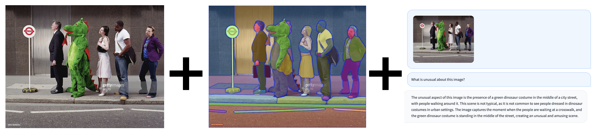

# Grounded LLaVa



SAM = Segment all objects in an image
Multi-model GPT-4/LLava/MiniGPT = Describe (describe semantics) in an image

Idea: Generate LLaVA-esque training data at scale from object detection datasets (Grounded LLaVa!)

# Requirements

Follow LlaVA installation instructions [here](https://github.com/haotian-liu/LLaVA/tree/main).

Install Segment Anything following instructions [here](https://github.com/facebookresearch/segment-anything).

# Generate Data and Train

You will need [COCO downloaded](https://cocodataset.org/#download).

```
python coco_inference/run_inference.py
```

Adjust paths in ```./scripts/finetune_lora.sh```.

```
bash /LLaVA/scripts/finetune_lora.sh
```

# Example data

```
"image": "000000338067",
        "conversations": [
            {
                "from": "human",
                "value": "Where is the bowl? They might be at these locations [230, 209, 269, 121],[0, 0, 499, 181],[112, 244, 52, 86],[129, 244, 170, 86],[472, 136, 23, 21],[229, 250, 270, 80],[213, 245, 103, 85]"
            },
            {
                "from": "gpt4",
                "value": "The bowl is at [531, 252, 22, 14]"
            }
        ]
```
